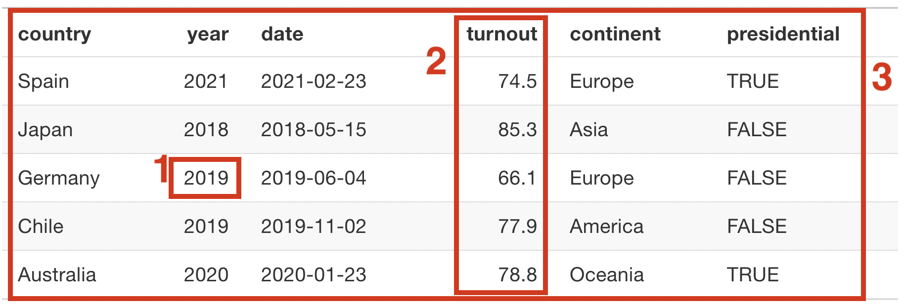
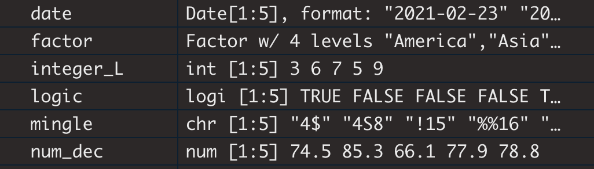

# L'estructura de dades d'R

```{r setup, include=FALSE}
knitr::opts_chunk$set(echo = TRUE)
library(dplyr)
```

Per a qualsevol usuari, l'estructura de dades d'R acaba resultant molt senzilla, però cal treballar-la bé i amb molta atenció perquè ens sigui del tot intuïtiva. En aquest mòdul aprendrem, de forma molt més sistemàtica, el procediment que haurem de repetir una i una altra vegada quan treballem amb R: 

1. Aprendrem a **crear objectes**, com el marc de dades que veiem a la taula \@ref(fig:df-intro), que contindran dades sobre temes que ens resultin interessants d'analitzar. 
2. Aprendrem a analitzar aquests marcs de dades aplicant-hi algunes funcions bàsiques.

```{r df-intro, echo = FALSE, fig.cap= "Els tres elements d'un marc de dades"}

```

Aquest marc de dades és un tipus d'objecte d'R. Els objectes emmagatzemen informació i principalment coneixerem tres maneres d'emmagatzemar-la:

  - A. Els [**valors**](#valors) són la unitat més petita d'R.
  - B. Una cadena de valors forma un [**vector**](#vectors).
  - C. Varis vectors d'igual longitud formen un [**marc de dades**](#marcsdades).

El codi per crear aquest marc de dades és el següent:

```{r eval = FALSE}
elections <- tibble(country = c("Spain", "Japan", "Germany", "Chile", "Australia"), 
                    year = as.integer(c(2021, 2018, 2019, 2019, 2020)), 
                    date = as.Date(c("2021/02/23", "2018/05/15", "2019/06/04", "2019/11/02", "2020/01/23")), 
                    turnout = c(74.5, 85.3, 66.1, 77.9, 78.8), 
                    continent = factor(c("Europe", "Asia", "Europe", "America", "Oceania")), 
                    presidential = c(TRUE, FALSE, FALSE, FALSE, TRUE))
```


2. Coneixerem **funcions**, com `glimpse()`, que serveixin per donar-nos informació, modificar o analitzar els objectes d'R.

   - Les funcions tenen varis **arguments**.


s'estructuren en diferents tipus d'objectes, als quals els hi aplicarem funcions. 


Rarament crearem marcs de dades de zero amb R, perquè és més fàcil de fer-ho amb programes com Excel. Amb R gairebé sempre importarem marcs de dades i els treballarem. Llavors, quin sentit té aprendre a crear un marc de dades amb R? El cas és que per treballar marcs de dades amb R és imprescindible conèixer bé la seva estructura. I la millor manera per conèixer l'estructura de dades d'R és aprendre a crear marcs de dades. Així ens serà molt més fàcil explotar els avantatges que ens ofereix el programa.


Ordenem una mica les idees que ja sabem a hores d'ara sobre R:

- Per treballar amb R necessitem **paquets**, que haurem de tenir prèviament instal·lats.
- Els paquets **s'activen**, un per un, amb la funció `library()`^[O amb funcions com `p_load()` del paquet `pacman`.].
- Els paquets contenen principalment **objectes** i **funcions**. També podem **crear** objectes i funcions pel nostre compte.
- Treballar amb R consisteix bàsicament a **aplicar funcions a objectes**.


## Objectes

Un **objecte** és un conjunt de dades que es troba emmagatzemat a R amb un nom determinat. Per emmagatzemar un conjunt de dades a R sempre utilitzarem el símbol `<-`. A l'esquerra del símbol posarem el `nom` de l'objecte i a la dreta les dades que volem emmagatzemar. Per exemple, amb el codi següent decidim emmagatzemar la dada `100` com a objecte que s'anomeni `nom`:

```{r collapse = TRUE}
nom <- 100
nom
```

Principalment, treballarem amb tres tipus d'objectes^[N'hi ha d'altres que no estudiarem, com les matrius de dades (*matrix*) o els *arrays*.]:

1. [Valors](#valors)
2. [Vectors](#vectors)
3. [Marcs de dades](#marcsdades)


### Valors{#valors}

Els **valors** són la unitat més petita que pot prendre un objecte d'R. Principalment, trobem tres tipus de valors: 

- [Nombres](#nombres) 
- [Caràcters](#caracters)
- [Lògics](#logics)

a) [**Nombres:**]{#nombres} Qualsevol nombre que emmagatzem a R quedarà registrat com a objecte numèric.

```{r collapse = TRUE}
d <- 4
d
```

També podem emmagatzemar resultats d'operacions. R només conserva a dins l'objecte el resultat numèric de l'operació, tal com veiem si imprimim `t`.

```{r collapse = TRUE, eval = TRUE}
t <- (4 + 6 + 7) / 3
t
```

Podem fer operacions combinant valors numèrics i objectes que contenen valors numèrics. En el codi següent sumem l'objecte `d`, l'objecte `t` (que hem creat prèviament) i el nombre `1`:

```{r collapse = TRUE}
d + t + 1
```

Fixem-nos que ens ha guardat els objectes `d` i `t` al Global Environment. També podem consultar en qualsevol moment els objectes que hem creat amb la funció `ls()`.

b) **Caràcters:** A R podem guardar qualsevol text que contingui caràcters, nombres i altres símbols. Sempre haurem de posar el text entre cometes.

```
z <- "Obama"
```
Molt important saber que R és sensible a les majúscules. Per R, `Obama` no és el mateix que `OBama` ni tampoc que `OBAMA`. Fem la prova: 

```{r collapse = TRUE}
"Obama" == "OBama"
"OBAMA" == "OBAMA"
```

En el primer cas li preguntem si `Obama` i `OBama` eren el mateix valor i ens ha respost que no, creant-nos com a resultat el valor lògic `FALSE`. En el segon cas ens ha confirmat que `OBAMA` i `OBAMA` són efectivament el mateix valor. Aquesta operació que acabem de fer és molt important com a punt de partida per comprendre l'utilitat dels valors lògics. 


<div class="alert alert-danger">
**Cometes i cometes:** És un error comú copiar text d'R a programes com Word, que segons com estiguin configurats poden canviar automàticament alguns símbols del text. El cas més habitual és el de les cometes, que ens les arrodoneix. Fixeu-vos amb la diferència:

- `"Cara"`: R entendrà que és un valor en forma de caràcter i el reproduïrà sense problema. 
- `“Cara”`: R ens donarà error perquè les cometes són arrodonides.
</div>


c) **Lògics:** Aristòtil defensava que, per lògica, les idees només poden ser veritat o mentida. De la mateixa manera, un valor lògic només pot ser veritat o mentida. Els podem emmagatzemar introduint `TRUE` (o el símbol `T`) o `FALSE` (o el símbol `F`).

```{r collapse = TRUE}
g <- T
g
w <- F
w
```

Amb els valors lògics podem fer operacions lògiques, com les que fèiem a les classes de filosofia. Per exemple, quan quelcom és verdader i fals (`T & F`), necessàriament ha de ser fals. Però si pot ser verdader o fals (`T | F`), això vol dir que pot ser verdader.

```{r collapse = TRUE}
g & w
g | w
```

Per ara només necessitem saber que existeixen els valors lògics. La seva *lògica* és un xic complicada, però hem de saber que ens seran de gran utilitat més endavant.

<div class="alert alert-info" role="alert">
**EXERCICIS VALORS:** Ves a la pàgina web següent i practica amb els exercicis que hi trobaràs.
</div>

### Vectors{#vectors}

Una cadena de valors forma un **vector**. Cada vector que creem només pot emmagatzemar valors d'un sol tipus. Per tant, als vectors que emmagatzemen nombres els hi direm vectors numèrics, els que emmagatzemen caràcters els hi direm vectors de caràcter i els que emmagatzemen valors lògics els hi direm vectors lògics. A partir d'aquests tres primers tipus també podem crear altres tipus de vectors. En aquest mòdul n'estudiarem: vectors enters, factors i vectors de data. 

Quan creem un vector, sempre concatenarem els valors, separats per comes, dins de la funció `c()`, com veiem en el següent exemple. És molt important tenir present aquesta estructura, perquè R ens donarà error si ens descuidem alguna coma entre valors. 
```
nom_objecte <- c(valor1, valor2, valor3, valor4)
```

Sempre serà preferible que els noms dels objectes tinguin alguna cosa a veure amb el seu contingut. Per exemple, si creem un vector amb noms de països, ens serà més útil anomenar-lo `countries` que no pas `vector` o `names`, que no ens aporta cap informació substantiva sobre el seu contingut.

A continuació crearem vectors de **longitud** cinc, que significa que estan formats per cinc valors. Però hem de saber que podem crear vectors d'un sol valor fins a vectors d'una longitud igual a milions de valors.


#### Vectors numèrics

Els vectors numèrics emmagatzemen nombres. Per crear-los, només hem de separar el valor de cada nombre per una coma. En el codi següent hem creat un objecte de nom `numeric` de longitud cinc. Si volem que els nombres tinguin decimals, haurem de marcar els decimals amb un punt com en el codi `num_dec`.  

```{r collapse = TRUE}
numeric <- c(4, 5, 6, 7, 8)
num_dec <- c(74.5, 85.3, 66.1, 77.9, 78.8)
```

Comprovem la longitud d'un dels vectors que hem creat amb la funció `length()`.

```{r collapse = TRUE}
length(num_dec)
```

També podem utilitzar objectes creats anteriorment.
```{r collapse = TRUE}
e <- 3
num_mix <- c(1, 3, e, 4, d)
```

I també podem utilitzar el símbol `:` per crear seqüències correlatives de valors. En aquest exemple, el primer valor del vector prendrà el valor de l'objecte `3` i la resta seran els nombres correlatius entre 4 i 7. Per tant, serà com si introduíssim `c(3, 4, 5, 6, 7)`, però estalviant-nos codi.
```{r collapse = TRUE}
num_points <- c(e, 4:7)
num_points
```

Els vectors numèrics permeten fer operacions matemàtiques com sumar (`+`), restar (`-`), multiplicar (`*`) o dividir (`/`). Hi ha dos tipus d'operacions que podem fer:

a) **Vector amb un nombre:** Ens fa l'operació de tots els valors del vector pel nombre en qüestió. En el següent cas, dividirà cada valor del vector `num_mix` entre 10.
```{r collapse = TRUE}
num_mix / 10
```

b) **Entre vectors d'igual longitud:** Quan fem una operació matemàtica entre dos o més vectors de la mateixa longitud, R ens farà l'operació entre els valors que tinguin la mateixa posició en el vector. Per exemple, si sumem els vectors `numeric` i `num_dec`, R sumarà el primer valor de `numeric` amb el primer valor de `num_dec`, el segon valor de `numeric` amb el segon valor de `num_dec` i així successivament.  

```{r collapse=T}
numeric + num_dec
```

Podem fer tantes operacions matemàtiques amb tants vectors com vulguem, sempre i quan respectin les normes descrites anteriorment. En canvi, si fem operacions amb vectors que tenen diferent longitud ens donarà error.

#### Vector enter

Una variant del vector numèric és el **vector enter**. Aquest tipus de vector, a diferència del numèric, no pot emmagatzemar decimals. És un vector que no utilitzarem gaire sovint, però que val la pena conèixer perquè forma la base d'altres tipus de vectors. Per crear-lo, hem de situar una `L` al davant de cada nombre o utilitzar la funció `as.integer()`. 

```{r collapse=T}
integer_L <- c(3L, 6L, 7L, 5L, 9L)
integer_L
integer_F <- as.integer(c(2021, 2018, 2019, 2019, 2020))
integer_F
```


#### Vector de caràcter

Els vectors de caràcter emmagatzemen caràcters. Per tant, com ja hem vist anteriorment, per crear-los haurem de fer servir les cometes. Per tant, envoltarem cada valor de les cometes que en el següent exemple. També hem de ser molt curosos amb no descuidar-nos cap de les cometes o R ens donarà error si intentem reproduir el codi.

```
character <- c("Spain", "Japan", "Germany", "Chile", "Australia")
```

Els vectors de caràcter no es restringeixen només als caràcters alfabètics. Podem emmagatzemar també nombres. En aquest cas, com que estan emmagatzemats com a caràcters, no tindran les propietats dels nombres i no hi podrem aplicar aplicacions matemàtiques.
```
numbers <- c("4", "8", "15", "16", "23")
```
I tota mena de símbols.
```
mingle <- c("4$", "4S8", "!15", "%%16", "漢字%3")
```

#### Factor

Una variant dels vectors de caràcter són els **factors**. De fet, el factor és un tipus de vector que per les seves característiques es troba entremig del vector de caràcter i el vector numèric. Formalment, un factor és un vector numèric que pot emmagatzemar caràcters. Aquesta definició no ens servirà de gaire ara mateix, però més endavant veurem la seva utilitat. Per ara, només ens cal saber que es crea si envoltem el concatenat de la funció `factor()`^[Als curiosos que hagueu anat a aquesta nota al peu, us explicarem una mica més sobre els factors. Si despullem el factor que hem creat amb la funció `unclass(factor)`, veiem exactament quina és la seva estructura real. En realitat, un factor és un vector enter i a cada nombre hi assigna una etiqueta. Si no li diem el contrari, l'assignació funciona per ordre alfabètic. Així, al nombre 1 hi ha assignat l'etiqueta "America", al nombre 2 l'etiqueta "Asia", i així successivament.].  
```
factor <- factor(c("Asia", "Asia", "Europe", "America", "Oceania"))
```

#### Vectors lògics

Els vectors lògics emmagatzemen valors lògics i per tant només poden prendre dos valors: `TRUE` o `FALSE`. A aquestes alçades no l'hi trobarem massa la seva utilitat, pel qual no ens detindrem gaire a explicar res més. Però, igual que els vectors, més endavant comprovarem que són un tipus de vector essencial en l'anàlisi de dades.

```
logic <- c(TRUE, FALSE, FALSE, FALSE, TRUE)
```

#### Vectors de data

I finalment, tenim els vectors de data. Com hem pogut suposar, aquests vectors emmagatzemen dates. La manera més senzilla de crear-los és introduir les dates en un vector de caràcter, de manera que a cada valor hi figuri primer amb l'any, després el mes i finalment el dia (YYYY/MM/DD). La funció `as.Date()` ens convertirà aquest vector en un vector de data^[Els curiosos que heu volgut saber més sobre els factors, probablement també us heu interessat sobre els vectors de data. Potser també heu fet el mateix procediment que a la nota al peu anterior i heu mirat de despullar el vector aplicant-hi `class(date)`. Sorpresa, els vectors de data són realitat un vector numèric. R assigna a cada nombre un dia, mes i any concret. Fixeu-vos que la data de 2018 correspon amb el nombre més baix i el de 2021 amb el nombre més alt. Sabríeu trobar quin és l'any 0?].

```
date <- as.Date(c("2021/02/23", "2018/05/15", "2019/06/04", "2019/11/02", "2020/01/23"))
date[2:5] - date[1:4]
```

Tampoc ens detindrem a estudiar a fons els vectors de data, però hem de saber que ens poden ser útils per fer operacions entre dates determinades. Per exemple, amb la operació següent sabem ràpidament que hi ha 1015 dies de diferència entre el 15 de març de 2018 i el 23 de febrer de 2021.

```
as.Date("2021/02/23") - as.Date("2018/05/15")
```
{width=50%}


<div class="alert alert-warning">
**Quin vector ens ha creat?**  

Ho podem veure a l'Environment. També ho podem preguntar.

```
class(logic)
is(date)
is(logic)
```

</div>

`class()`
`rm()`
`typeof()`
`attributes()`


<div class="alert alert-warning">
**Què passa si combinem diferents tipus de valors en un mateix vector?**  

Potser alguns ja haureu provat de crear un vector que contingui valors de diferent tipus. Si n'intentem crear un, veurem que, sorprenentment, R no dona error sinó que ens crea el vector. El que fa R és una cosa que se'n diu **coerció de les dades**, que significa la conversió automàtica dels valors d'un tipus als valors d'un altre tipus. Vegem-ne alguns exemples:
```
num_log <- c(44, TRUE)
car_log <- c("Hello", TRUE)
num_car <- c(43, "Hello")
num_car_log <- c(43, "Hello", TRUE)
```
Si us hi heu fixat, la lògica que segueix és la següent: **Caràcter > Numèric > Lògic**. Entre caràcters i nombres, R crearà un vector de caràcter. Entre nombres i valors lògics, R crearà un vector numèric. Això és així perquè és la manera que ens permet conservar el màxim d'informació. `TRUE` i `FALSE` els podem guardar com a `1` i `0` en un vector numèric, de manera que no perdem la pista sobre què era originàriament cada valor. En canvi, el nombres `100` i `59` no tenim manera de guardar-los en un vector lògic sense perdre informació. Finalment, com que en un vector de caràcter hi podem guardar qualsevol cosa, un valor de caràcter sempre guanyarà la coerció contra qualsevol altre valor.
</div>


<div class="alert alert-danger" role="alert">

**ERROR, ERROR, ERROR:** Aquests són els tres errors clàssics que fem quan creem vectors. Sabries identificar-los a cada exemple?^[Solució: En el primer cas, no hem separat el 6 i el 7 amb una coma. En el segon cas, no hem tancat la cometa de France. En el tercer cas, no hem tancat parèntesi.]
```
c(4, 5, 6 7, 8)
c("Spain", "France, "Germany", "Italy", "Belgium")
c(TRUE, FALSE, FALSE, FALSE, TRUE
```
</div>
EXERCICIS VECTORS
<div class="alert alert-info" role="alert">
</div>

### Marc de dades

Un conjunt de vectors d'igual longitud forma un **marc de dades**. El marc de dades és un tipus d'objecte que guarda les dades en dues dimensions: les files i les columnes. A continuació, crearem un marc de dades amb tots els tipus de vectors que hem estudiat fins ara. La funció que utilitzarem és la funció `tibble()`. Només cal posar tants noms dels vectors com necessitem a dins de la funció, separats per comes.

```
tibble(vector1, vector2, vector3, vector4...)
```

El requisit que tots els vectors han de tenir la mateixa longitud és indispensable. Si tots els vectors no tenen la mateixa longitud, ens donarà error^[Hi ha la funció `data.frame()` però és una mica antiquada i no l'estudiarem.].

```{r}
country <- c("Spain", "Japan", "Germany", "Chile", "Australia")
year <- as.integer(c(2021, 2018, 2019, 2019, 2020))
date <- as.Date(c("2021/02/23", "2018/05/15", "2019/06/04", "2019/11/02", "2020/01/23"))
turnout <- c(74.5, 85.3, 66.1, 77.9, 78.8)
continent <- factor(c("Europe", "Asia", "Europe", "America", "Oceania"))
presidential <- logic <- c(TRUE, FALSE, FALSE, FALSE, TRUE)
elections <- tibble(country, year, date, turnout, continent, presidential)
```

Si imprimim el marc de dades `elections` ens dona el següent resultat.

```{r echo = FALSE}
elections %>% 
  knitr::kable()
```

Si comptem les **files** i les **columnes** d'aquest marc de dades, ràpidament veurem que està format per 5 files i 6 columnes. Com que és un marc de dades petit, podem comptar-les amb relativa facilitat. Però normalment treballarem amb marcs de dades enormes i comptar-los no serà tant fàcil. O sí. Només cal que utilitzem la funció `dim()`^[La funció `dim()` és la que ens permet saber específicament el nombre de files i columnes. Però també podem obtenir aquests nombres imprimint el marc de dades o amb altres funcions com `glimpse()`.].

```
dim(elections)
```

Més fàcil així, perquè no crea més objectes del compte. 
Ha de seguir la següent estructura:
```
tibble(nom_variable1 = c(valor1, valor2, valor3),
       nom_variable2 = c(valor1, valor2, valor3),
       nom_variable2 = c(valor1, valor2, valor3))
```
Si ho apliquem al que ja hem fet:

```{r}
elections <- tibble(country = c("Spain", "Japan", "Germany", "Chile", "Australia"), 
                    year = as.integer(c(2021, 2018, 2019, 2019, 2020)), 
                    date = as.Date(c("2021/02/23", "2018/05/15", "2019/06/04", "2019/11/02", "2020/01/23")), 
                    turnout = c(74.5, 85.3, 66.1, 77.9, 78.8), 
                    continent = factor(c("Europe", "Asia", "Europe", "America", "Oceania")), 
                    presidential = c(TRUE, FALSE, FALSE, FALSE, TRUE))
```

Quan vulguem fer servir un vector de dins un marc de dades, utilitzarem el símbol `$`. Així, prenent com a referència el marc de dades `elections`, si volem consultar el vector `presidential` farem servir el codi següent:

```
elections$presidential
```

Selecció d'objectes


```
install.packages()
```

<div class="alert alert-danger" role="alert">
**Errors típics**
Hem de tenir molta cura amb el codi. 

- Descuidar-se la coma després de cada vector.
- No tancar algun parèntesi.
- Els errors de vector que ja hem vist abans.
</div>

<div class="alert alert-info" role="alert">
EXERCICIS MARCS DE DADES
</div>

## Funcions

A aquestes alçades, en aquest mòdul ja hem vist més d'una dotzena de funcions. Heu conegut funcions com `tibble()`, `c()` `length()`, `ls()` o `class()`, però encara no us les hem presentat formalment.

### Què és una funció?

Les **funcions** són els verbs d'R i ens permeten realitzar accions, normalment amb objectes. La millor manera per aprendre què és una funció és crear-ne una de nova. Les funcions es creen igual que els objectes, amb el símbol `<-`, seguit de `function()` i de les indicacions de l'acció que durem a terme a dins dels parèntesis `{}`. Fixem-nos en el següent exemple:

- Creem la funció `per_tres()`.
- A dins de la funció hi introduïrem l'argument `x`.
- L'ordre que deixem guardada és: `multiplica x per 3`.

```
per_tres <- function(x) {x * 3}
```
Un cop haguem creat la funció `per_tres()`, anem a testar-la: 
```
per_tres(x = 4)
```
La funció actua i ens retorna el resultat `12`. Això és perquè les indicacions de la funció eren molt clares: `multiplica x per 3`. Com en aquest cas, les funcions ens transformen els objectes i ens retornen el resultat de la transformació.

En el cas anterior, hem fer servir un **argument**. L'argument `x`. Però podríem dissenyar una funció amb varis arguments. 

- Creem la funció `per_tres_resta()`.
- Primer li diem que multipliqui l'argument `x` per tres.
- Després li diem que resti l'argument `y`.
```
per_tres_resta <- function(x, y) {x * 3 - y}
```
Ara testarem la funció `per_tres_resta()`: 
```
per_tres_resta(x = 10, y = 5)
```
També serviria així, sempre que respectem l'ordre.
```
per_tres_resta(10, 5)
```

L'objectiu d'aquest mòdul no és aprendre a crear funcions, però aquests senzills exercicis poden servir per entendre millor la seva naturalesa. Bàsicament, l'estructura de les funcions és la següent:

```
funcio(argument1, argument2, argument3, ...)
```


## Arguments

- A vegades no cal cap argument: `ls()`.
```
ls()
```
- A vegades necessitarem un argument, normalment el primer argument és un objecte: `length()`.
```
length()
sum()
paste()
```
- A vegades necessitarem introduir més informació: 
```
round()
max()
min()
seq(inici, final, separació)
rnorm()
sample()
```

Arguments
-	?
-	args()
-	max()
-	rep(c(1,2,3), 4, 10)

sample(1:10, 2)
sample(c("Cara", "Creu"), 1)


## Ajuda


Les podem combinar. De dins cap a fora. Primer ens farà el resultat de la funció més propera a l'objecte. En el següent exemple, primer suma els valors del `vector_numeric` i després arrodoneix el resultat.

```
round(sum(vector_numeric))
```


<div class="alert alert-info" role="alert">
EXERCICIS
</div>


## Importar

També podem clicar el nom de l'arxiu al directori de treball i posar 'Importar'


## Resum


