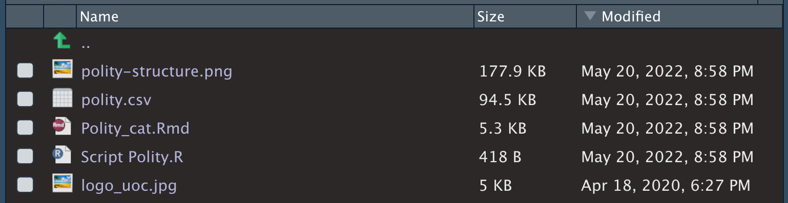

# RMarkdown

Tant important és generar dades com poder-les comunicar. [RMarkdown](https://rmarkdown.rstudio.com/) és un tipus de document que permet combinar text i codi d'R i permet generar informes en format Html, Pdf, Word o en diapositiva, entre d'altres, normalment amb l'objectiu de ser compartits davant d'una audiència. La millor manera per comprendre què ens permet fer RMarkdown és veure alguns exemples dels documents que podem produir. En aquesta [galeria](https://rmarkdown.rstudio.com/gallery.html) podem veure diversos tipus de documents que podem produir amb RMarkdown. Relacionats amb la nostra disciplina, podem produir petits articles que barregen text i dades com [*Three ways to measure liberal democracy in the world*](https://www.jordimas.cat/post/2022-03-10-vdemfall/) o [*Start wars. Russia as a war initiator*](https://www.jordimas.cat/post/2022-03-18-start_wars/). 

<div class="alert alert-info">
**Pas 1. Què podem fer amb RMarkdown:** Entra a la [**RStudio Gallery**](https://rmarkdown.rstudio.com/gallery.html) i observa alguns dels documents que es poden crear amb RMarkdown. Fixa't bé amb com text, codi, taules i gràfics de tot tipus es combinen en el document. 
</div>

L'objectiu d'aquest mòdul és mostrar els passos essencials per aprendre a utilitzar RMarkdown. En concret, aprendrem a:  

- [Crear un RMarkdown](#crear-rmarkdown)
- [Combinar codi i text](#bliblu)
- [Posar taules](#rmd-taules)
- [Introduir imatges](#rmd-imatges)
- [Posar gràfics](#grafics)
- [Inserir bibliografia](#rmd-rpubs)
- [Altres opcions, com exportar a Html mitjançant RPubs](#rmd-biblio)


Hi ha moltes altres possibilitats que no aprendrem. No obstant, en podreu saber més en documents online com: 

- [RMarkdown from RStudio](https://rmarkdown.rstudio.com/lesson-1.html)
- [RMarkdown: The Definitive Guide](https://bookdown.org/yihui/rmarkdown/html-document.html)


## Crear un RMarkdown{#crear-rmarkdown}

Sempre que comencem una activitat nova, el més adequat és crear un projecte nou. Els passos per crear un projecte estan explicats en un [altre apartat](#apartat). 

Un cop haguem creat el nou projecte, instal·larem els paquets `rmarkdown` i `knitr`:
```
install.packages(c("rmarkdown", "knitr"))
```

De moment, no caldrà que carreguem els paquets. RMarkdown és un tipus d'arxiu semblant a l'Script, però amb algunes diferències essencials que anirem veient al llarg d'aquest mòdul docent. Fixem-nos que es crea des del mateix desplegable de l'Script. 

{width=50%}

<div class="alert alert-info">
**Pas 2. Crear un RMarkdown:** Si premem el botó per crear un RMarkdown, ens sortirà la següent quadre on podrem introduir les característiques bàsiques del document.

{width=50%}  
Deixarem les opcions per defecte de crear un Document en Html, introduïrem el nostre nom i un títol i premerem el botó OK.
</div>

Acabem de crear el nostre primer document de RMarkdown. Sempre que vulguem crear un RMarkdown des de zero haurem de seguir aquest mateix procediment. No obstant, per aprendre el funcionament de RMarkdown, en aquest mòdul utilitzarem una plantilla tutorial. Per això, ara **tancarem** l'arxiu `.Rmd` que hem acabat de crear i continuarem a la següent secció.


## Preparar el tutorial{#preparar-rmarkdown}

Per aprendre a utilitzar RMarkdown, descarregarem el zip [Tutorial_Rmd_UOC.zip](https://www.jordimas.cat/img/fiiei/Tutorial_Rmd_UOC.zip), on es troben tots els documents que necessitem.


<div class="alert alert-info">
**Pas 3. Preparar el tutorial:** Per preparar aquesta activitat, descarregarem i descomprimirem l'arxiu Tutorial_Rmd_UOC.zip. Situarem els arxius que conté al nostre directori de treball, tal com es veu en la següent imatge:

{width=70%}

1. `polity-structure.png`: Aquesta imatge és un esquema de l'estructura de l'índex Polity.
2. `polity.csv`: És una versió simplificada de la base de dades Polity V, gestionada pel [Center for Systemic Peace](https://www.systemicpeace.org/inscrdata.html). 
3. `Polity_cat.Rmd`: L'arxiu RMarkdown que conté el tutorial.
4. `Script Polity.R`: Hi podem veure el codi que hem utilitzat per convertir l'arxiu original de Polity V a la versió modificada amb la que treballarem.
5. `logo_uoc.jpg`: És un logo d'UOC, que el farem servir al final de tot d'aquest mòdul.
</div>

<div class="alert alert-danger">
**Automatitzar les descàrregues:** En moltes ocasions, podem automatitzar la descàrrega d'arxius amb la funció `download.file()`. En el cas de l'arxiu Tutorial_Rmd_UOC.zip, el següent codi descarrega l'arxiu i el descomprimeix al directori de treball.

```
# Download zip file
download.file("https://www.jordimas.cat/img/fiiei/Tutorial_Rmd_UOC.zip", "Tutorial_Rmd_UOC.zip")

# Unzip file
unzip("Tutorial_Rmd_UOC.zip")
```
No obstant, en aquest mòdul mostrem la descàrrega manual perquè la funció `download.file()` dona problemes en alguns ordinadors. El problema el notarem quan intentem convertir els arxius descarregats en mode automàtic a objecte d'R amb alguna funció `read`. Si ens dona un missatge d'error a la consola, haurem l'eliminar els arxius que haguem descarregat amb la funció `download.file()` i els tornarem a descarregar manualment.
</div>

Un com tinguem tots els arxius que necessitem al directori de treball, obrirem l'arxiu `Polity_cat.Rmd` i ens fixarem en la **barra superior** del document. Veiem com hi ha dos botons:

- El botó Knit ens converteix el document en Html.
- El botó de la rodeta obre un desplegable on podem seleccionar algunes opcions. 


{width=80%}


<div class="alert alert-info">
**Pas 4. Configurar RMarkdown:** Obrirem el desplegable de la rodeta i ens assegurarem que les opcions estiguin amb `Preview in Viewer Pane` i `Chunk Output in Console`, com s'indica a la següent imatge^[L'opció `Preview in Viewer Pane` fa que l'Html s'obri a la pestanya Viewer, dins d'RStudio. Per contra, si podem `Preview in Viewer Window` l'Html s'obrirà en el nostre navegador d'internet. Si volem utilitzar el RMarkdown com un Script, `Chunk Output in Console` farà que tots els resultats i missatges es visualitzin a la consola, com passa normalment quan utilitzem un Script d'R. En canvi, `Chunk Output Inline` farà que els resultats i missatges es visualitzin a dins mateix del RMarkdown.]. 

{width=40%}

Quan acabem de configurar aquestes opcions, pitjarem el botó **Knit**.
</div>

Algunes de les coses que han passat són:

- Apareix l'Html a **Viewer**. Podem obrir al navegador. Per tornar a Files (1).
- La Consola s'amaga i apareix la pestanya **Render**. Per tornar a la consola (2).
- S'amaga la finestra de l'Environment. Per tornar a la vista anterior (3). 


## Elements de RMarkdown

Sempre que pitgem el botó Knit (amb el teclat, `Ctrl + Shift + K`), R llegeix el document de RMarkdown i el transforma en un document d'Html, en Pdf o en Word, segons haguem indicat. Si el reproduïm en Html, el document s'obrirà a la finestra Viewer perquè així ho hem seleccionat anteriorment a les opcions. La imatge que hauríem de veure a la nostra pantalla hauria de ser molt semblant a la següent. Fixem-nos bé amb els **elements** que hem destacat:

- **YAML:** Conté les metadades del document.
- **Chunk:** Conté el codi d'R.
- **Text:** Conté el text.

L'icona assenyalat a la imatge amb quadre vermell obre l'Html al navegador d'internet que tenim configurat per defecte.

{width=80%}

Si observem amb atenció el document de RMarkdown i el comparem amb l'Html que ha generat, veurem que elements com el títol o la data figuren al YAML. També observem que el símbol `#` marca els títols del document. I que hi ha un element que es diu chunk que, curiosament, no es veu a l'Html. A continuació explicarem amb detall aquests tres elements: YAML, text i chunk. 

<div class="alert alert-info">
**Pas 5. Llegeix el tutorial:** Llegeix l'arxiu `Polity_cat.Rmd`. Ves alternant la lectura entre el document de RMarkdown amb el document d'Html, de manera que puguis anar veient com els elements de RMarkdown queden reflectis en l'Html. Quan facis canvis al RMarkdown, fes Knit per veure els canvis reflectis a l'Html. 
</div>

### YAML

La primera part d'un document de RMarkdown se'n diu el YAML. Està delimitada per tres guions `---` al principi i al final. 

Conté les metadades. Posarem informació general com el títol, l'autoria i la data, i també indicacions de com es reproduirà el document: si serà Html, Pdf o Word. També hem afegit que enumeri les seccions (`number_sections: true`), que posi una taula de continguts (`toc: true`), que aquesta taula de continguts sigui flotant (`toc_float: true`) i que tingui una profunditat de tres 

output: 
  html_document:
    number_sections: true
    toc: true
    toc_float: true
    toc_depth: 3


Podeu conèixer més funcionalitats al [](#yaml-plus)


### Text

Com sabeu, RMarkdown serveix per intercalar text i codi. El **text** es pot inserir a qualsevol línia de codi per sota del YAML i per defecte es reproduirà en lletra rodona. 

- Si volem fer servir **negretes**, envoltarem el text amb dos asteriscos (`**text**`).
- Si volem fer servir _cursives_, envoltarem el text amb un asterisc o bé amb un guió baix (`*text*` o `_text_`).
- Si volem posar `lletra de codi`, envoltarem el text amb dos accents oberts (`` `text` ``).
- Si volem afegir un [enllaç web](www.jordimas.cat), posarem el nom del text entre claudàtors seguit de la direcció de l'enllaç entre parèntesis (`[Web](www.jordimas.cat)`).
- Si volem afegir una nota al peu^[Això és una nota al peu], posarem el text entre claudàtors i el precedirem per un símbol d'intercalació (`^[Nota al peu]`).


Els títols de secció es marquen de la seguent manera:

```
# Títol de secció

## Títol de subsecció

### Títol de subsubsecció
```

Si volem crear llistes, deixarem una línia de codi de marge entre el text i el primer ítem de la llista, que començarem amb `*`, `-` o `+`. Podem crear subnivells si afegim quatre espais.

```
- primer ítem
- segon ítem
- tercer ítem
    - primer subítem
    - segon subítem
    - tercer subítem
```

Al document d'Html apareixerà de la següent manera:

- primer ítem
- segon ítem
- tercer ítem
    - primer subítem
    - segon subítem
    - tercer subítem


Les llistes també poden començar amb nombres.

```
1. primer ítem
2. segon ítem
3. tercer ítem
    - primer subítem
    - segon subítem
    - tercer subítem
```

Al document d'Html apareixerà de la següent manera:

1. primer ítem
2. segon ítem
3. tercer ítem
    - primer subítem
    - segon subítem
    - tercer subítem
    
Hi ha més possibilitats d'edició de text, que podeu consultar a [Sintaxi RMarkdown](https://bookdown.org/yihui/bookdown/markdown-syntax.html).


### Chunks

Els **chunks** permeten afegir codi d'R document de RMarkdown. Per crear chunks nous:  

- Premem `Ctrl + Alt + I` (Mac: `Cmd + Option + I`).
- O, alternativament, podem simplement copiar i enganxar un chunk que ja estigui creat i modificar-ne el seu contingut.

Els chunks tenen aquesta forma:

{width=70%}

- ```` ```{r} ````: L'**inici** del chunk està marcat per tres accents oberts i la lletra `r`, que indica que a dins el chunk hi haurà codi d'R.
- Al **mig** del chunk, en blanc a la imatge, és on posarem el codi d'R.
- ```` ``` ````: El **final** del chunk està marcat per tres accents oberts.

A la dreta de la lletra `r` és on indicarem, opcionalment, el títol del chunk i què volem que es visualitzi a l'Html. Aquesta és una taula resum de les principals especificacions que podem posar al chunk.


| Ordre      | Defecte | Què fa?                                                 |
|------------|---------|---------------------------------------------------------|
| `message`  | `TRUE`  | Mostra els missatges que ens apareixerien a la consola. |
| `warning`  | `TRUE`  | Mostra els avisos que ens apareixerien a la consola.    |
| `echo`     | `TRUE`  | Amaga el codi el chunk.                                 |
| `eval`     | `TRUE`  | Reprodueix el chunk.                                    |
| `include`  | `TRUE`  | Ho mostra tot.                                          |


Per exemple, al chunk següent li hem posat com a títol `prova`, li diem que volem veure el codi (`echo = TRUE`), que volem veure el resultat del codi (`eval = TRUE`) i que amagui els missatges que apareguin a la consola.

{width=70%}

A l'Html, aquest chunk es visualitzarà així.

```{r prova, echo = TRUE, eval = TRUE, message = FALSE}
plot(datasets::co2)
```

Si en canvi, posem `echo = FALSE`, amagarem el codi però visualitzarem igualment el seu resultat.

Hi ha tres regles d'or que hem de seguir:

- Els títols de chunk no es poden repetir.
- Los chunks deben ser secuenciales.
- Per visualitzar com queden els canvis a l'Html, haurem de fer Knit.


No té en compte les funcions que tinguem carregades en aquell moment a R ni tampoc els objectes que hi hagi creats al Environment. Això significa que primer llegirà els primers chunks del document i anirà seguint cap avall, en ordre. Això vol dir que els chunks hauran de seguir l'ordre lògic que coneixem d'R. Per exemple:

1. En el primer chunk carreguem els paquets que utilitzarem en els chunks següents.
2. En el segon chunk utilitzem funcions dels paquets que hem carregar prèviament per crear objectes.
3. En el tercer chunk creem un gràfic a partir de l'objecte que hem creat prèviament.

Si en canvi, enlloc de Knit, utilitzem el RMarkdown com un Script normal (Ctrl+Enter), funcionarà com un Script d'R. En aquest cas sí que tindrà en compte els paquets que haguem carregat a R i els objectes que tinguem a l'Environment.


<div class="alert alert-danger">
**Errors de Knit:** Dos dels errors més freqüents amb Knit de RMarkdown van relacionats amb errors en l'ordre lògic 

- Utilitzem funcions de paquets que no es carreguen en chunks anteriors.
- Utilitzem objectes que no hem creat en chunks anteriors.

Tampoc s'han de posar mai les funcions `install.packages()` i `View()` dins dels chunks de RMarkdown. Donarà error quan fem Knit.
</div>


### Marc de dades, gràfics, imatges i taules

#### Marc de dades{#rmd-marcsdades}


Per visualitzar marcs de dades a dins de RMarkdown utilitzeu sempre la funció `head()`, tal com indiquem a continuació. Si, en canvi, només escribim `polity` a dins el chunk, ens reproduirà totes les files a l'Html (i aquest marc de dades té més de 15.000 files pel qual serà un arxiu interminable!).

- Fixeu-vos que hem amagat el codi amb `echo = FALSE`.

```{r polity, eval = FALSE}
head(polity, 10)
```


#### Taules{#rmd-taules}


#### Imatges{#rmd-imatges}

Tenim dues maneres d'inserir imatges a RMarkdown.

- A través de ``

- A traves d'un chunk, amb la funció `include_graphics()` del paquet `knitr`.


```{r eval = FALSE}
include_graphics("cinc-structure.png")
```

Podem jugar amb les mides de la imatge


## Utilitzar RMarkdown com a Script

Una de les diferències que a vegades costa més de distingir és 

- Knit
- Script: 


## RMarkdown avançat

### Codi al text

r polity$country[1]

### YAML avançat{#yaml-plus}

Podem posar la data automàticament:
`date: "5/1/2022"`

Podem posar una foto al costat del títol:  
`title: "{width=2in}"`

temes

### Setup


No és obligatori, però és recomanable tenir un primer chunk `setup` amb algunes configuracions bàsiques del nostre RMarkdown. Principalment, aquest chuck ens pot servir per dues coses:

- Per establir per defecte com reproduïrem els chunks.  
```
knitr::opts_chunk$set(echo = FALSE, message = FALSE, warning = FALSE)
```

- Per carregar els paquets que necessitem.


### Taules


### Gráfics


### Posar bibliografia{#rmd-biblio}


### Caixetes blaves


### Canviar mida de text

```
<style>
body {
font-size: 13pt;
text-align: justify}
</style>
```

### Publicar a web{#rmd-rpubs}

RPubs

## Saber més de RMarkdown

If you want to know more about RMarkdown, use these links:  

[Guía rápida](https://rmarkdown.rstudio.com/lesson-11.html)

[R for Data Science](https://r4ds.had.co.nz/r-markdown.html)


- [Bookdown](https://bookdown.org/yihui/bookdown/markdown-syntax.html#inline-formatting)
- [RMarkdown Cheat Sheet in Spanish](https://rstudio.com/wp-content/uploads/2015/03/rmarkdown-spanish.pdf)
- [Brief summary in R para ciencia de datos](https://es.r4ds.hadley.nz/r-markdown.html)


